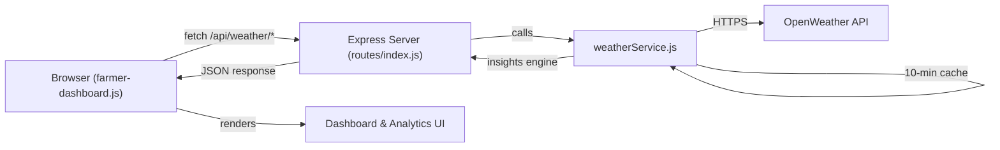

# OpenWeather API Integration — Walkthrough

## Summary

Integrated the **OpenWeather API** into Project Weather to replace all hardcoded/mock weather data with **live real-time data** from Calamba, Laguna. The system now fetches current conditions and a 5-day forecast from OpenWeather, generates agricultural insights, and renders everything dynamically across the dashboard and weather analytics pages.

## Architecture



## Files Changed

### New Files
| File | Purpose |
|------|---------|
| [weatherService.js](file:///c:/Users/ferna/Desktop/WEATHER/utils/weatherService.js) | Backend service: API calls, caching, data transformation, agricultural insights |

### Modified Files
| File | Changes |
|------|---------|
| [.env](file:///c:/Users/ferna/Desktop/WEATHER/.env) | Added `OPENWEATHER_API_KEY`, `WEATHER_LAT`, `WEATHER_LON` |
| [index.js](file:///c:/Users/ferna/Desktop/WEATHER/index.js) | Updated CSP to allow OpenWeather domains |
| [routes/index.js](file:///c:/Users/ferna/Desktop/WEATHER/routes/index.js) | Added 5 new API endpoints for weather data |
| [farmer-dashboard.html](file:///c:/Users/ferna/Desktop/WEATHER/views/farmer-dashboard.html) | Dynamic weather cards, forecast, alerts, insights |
| [weather-analytics.html](file:///c:/Users/ferna/Desktop/WEATHER/views/weather-analytics.html) | Dynamic predictor, risk dashboard, current conditions |
| [farmer-dashboard.js](file:///c:/Users/ferna/Desktop/WEATHER/public/js/farmer-dashboard.js) | ~360 lines of weather rendering logic added |

## New API Endpoints

| Endpoint | Method | Description |
|----------|--------|-------------|
| `/api/weather/current` | GET | Current weather data (temperature, humidity, wind, rain, pressure, etc.) |
| `/api/weather/forecast` | GET | 5-day forecast aggregated into daily summaries |
| `/api/weather/risks` | GET | Forecast risk analysis with agricultural context |
| `/api/weather/log` | POST | Save current weather to WeatherLog table |
| `/api/weather/history` | GET | Retrieve historical weather logs |

## Key Features Implemented

- **Live metric cards** — Temperature, Humidity, Wind Speed, Rainfall update from real API data
- **Agricultural insight engine** — Generates context-aware messages like "Optimal for Rice tillering" or "Fungal risk elevated" based on thresholds
- **5-day forecast with icons** — Uses OpenWeather weather condition icons
- **Rainfall trend visualization** — Color-coded bars (green/amber/red) based on rainfall severity
- **Dynamic alerts** — Generated from current conditions, not hardcoded
- **Decision insights** — Temperature and humidity analysis with crop recommendations
- **Live "Safe to Plant" predictor** — Uses real forecast data against crop tolerance databases
- **Risk dashboard** — Auto-generates risk cards from forecast data
- **Current conditions card** — 6-metric grid on weather analytics page
- **Forecast summary** — Aggregated statistics from 5-day outlook
- **Weather archive** — Populates table from forecast data
- **10-minute caching** — Prevents API rate limit issues
- **10-minute auto-refresh** — Keeps data current without page reload
- **Graceful error handling** — Shows "Weather data unavailable" if API key is missing

## How to Activate

> [!IMPORTANT]
> You need to add your OpenWeather API key to the `.env` file:

1. Go to [openweathermap.org/api](https://openweathermap.org/api) and sign up for a free account
2. Copy your API key from the dashboard
3. Open `.env` and replace `your_openweather_api_key_here` with your actual key:
   ```
   OPENWEATHER_API_KEY=abc123your_actual_key_here
   ```
4. Restart the server with `npm run dev`
5. Open `http://localhost:4000/farmer/dashboard` — weather data will load live!

## Verification

- ✅ Server starts without errors
- ✅ `weatherService.js` module loads correctly
- ✅ API endpoints return proper JSON (or graceful 503 with fallback message when key is invalid)
- ✅ CSP headers updated to allow OpenWeather domains
- ✅ Frontend handles API errors gracefully with "data unavailable" messages
